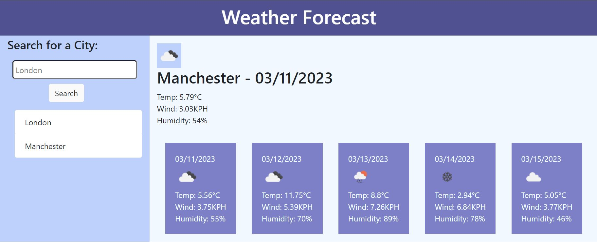
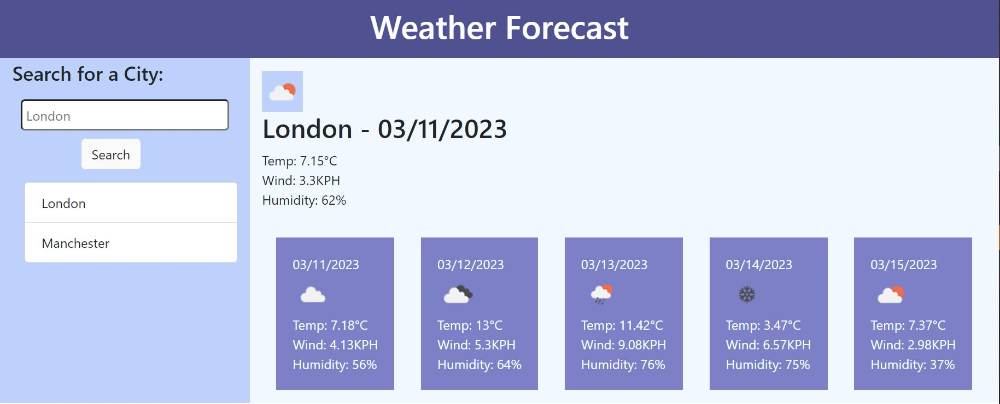

# Weather_forecast

## Description
This application retrieves weather forecast information from the OpenWeatherMap API based on the user's input and displays the current weather information and a five-day forecast. Users can search for a city, and the application will display the weather information for that city.

## Features
- Retrieves weather forecast information from OpenWeatherMap API.
- Displays the current weather information and five-day forecast.
- Stores previous search history using LocalStorage.
- Uses moment.js library to format dates.
- Uses jQuery library to handle user input and make API calls.

## How to Use
- Enter the name of a city in the search bar and click the "Search" button.
- The current weather information and a five-day forecast for the city will be displayed.
- The application stores previous search history using LocalStorage.
Click on a previous search history item to display the weather information for that city.
## Technologies Used
- HTML
- CSS
- JavaScript
- jQuery
- moment.js
- OpenWeatherMap API
## Instalation 
N/A
## License
MIT

## Deployed Link
https://puspitagoswami.github.io/Weather_forecast/

